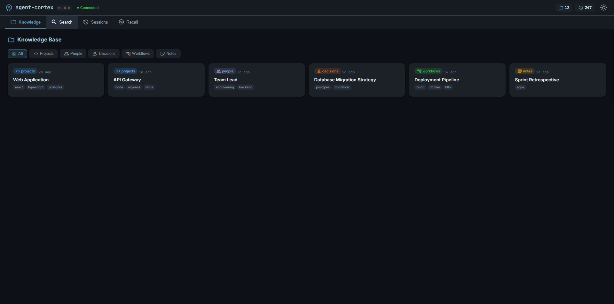
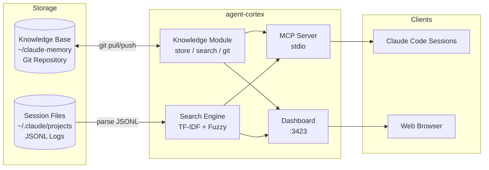

# agent-cortex

[](LICENSE)
[](https://nodejs.org)
[]()
[]()

**Cross-session memory and recall for AI agents** -- git-synced knowledge base meets TF-IDF ranked session search.

<table>
<tr>
<td></td>
<td></td>
</tr>
<tr>
<td align="center"><em>Knowledge base with category filtering</em></td>
<td align="center"><em>TF-IDF ranked session search</em></td>
</tr>
</table>



## Why

Claude Code sessions are ephemeral. When a session ends, everything it learned -- architecture decisions, debugging insights, project context -- is gone. The next session starts from scratch.

**agent-cortex** solves this with two complementary systems:

1. **Knowledge Base** -- a git-synced markdown vault of structured entries (decisions, workflows, project context) that persists across sessions and machines.
2. **Session Search** -- TF-IDF ranked full-text search across JSONL session transcripts, so agents can recall what happened before.

| Feature | agent-cortex | claude-task-master | MCP Agent Mail | claude-historian |
|---|---|---|---|---|
| Git-synced knowledge base | Yes | No | No | No |
| TF-IDF ranked search | Yes | No | No | TF-IDF |
| Fuzzy matching | Yes | No | No | Fuzzy |
| Scoped recall (6 scopes) | Yes | No | No | 11 scopes |
| Real-time dashboard | Yes | No | No | No |
| Cross-machine sync | Yes | No | Git audit trail | No |
| Structured categories | Yes | No | No | No |

## Features

- **TF-IDF ranked search** -- results ordered by relevance with cached index (~40ms warm queries)
- **Git-synced knowledge base** -- markdown vault with YAML frontmatter, auto commit and push on writes
- **Fuzzy matching** -- typo-tolerant search using Levenshtein distance
- **6 search scopes** -- errors, plans, configs, tools, files, decisions
- **Cross-machine persistence** -- knowledge syncs via git, sessions read from local JSONL
- **Real-time dashboard** -- browse, search, and manage at `localhost:3423`
- **Stateless session search** -- no indexing step needed, reads JSONL files directly
- **Zero external search deps** -- no Tantivy, no vector DB, no embeddings

## Quick Start

```bash
git clone https://gitlab.mukit.at/development/agent-cortex.git
cd agent-cortex
npm install && npm run build
```

### Configure in Claude Code

```bash
claude mcp add agent-cortex -s user \
  -e CORTEX_MEMORY_DIR="$HOME/claude-memory" \
  -- node /path/to/agent-cortex/dist/index.js
```

Or add to `settings.json` permissions:

```json
{
  "permissions": {
    "allow": ["mcp__agent-cortex__*"]
  }
}
```

Dashboard: **http://localhost:3423** (auto-starts with MCP server)

## MCP Tools

### Knowledge Base

| Tool | Description | Parameters |
|---|---|---|
| `cortex_list` | List entries by category and/or tag | `category?`, `tag?` |
| `cortex_read` | Read a specific entry | `path` (required) |
| `cortex_write` | Create/update entry (auto git sync) | `category`, `filename`, `content` (all required) |
| `cortex_delete` | Delete an entry (auto git sync) | `path` (required) |
| `cortex_sync` | Manual git pull + push | -- |

### Session Search

| Tool | Description | Parameters |
|---|---|---|
| `cortex_sessions` | List sessions with metadata | `project?` |
| `cortex_search` | TF-IDF ranked search across transcripts | `query` (required), `project?`, `role?`, `max_results?`, `ranked?` |
| `cortex_get` | Retrieve full session conversation | `session_id` (required), `project?`, `include_tools?`, `tail?` |
| `cortex_summary` | Session summary (topics, tools, files) | `session_id` (required), `project?` |
| `cortex_recall` | Scoped search across sessions | `scope` (required), `query` (required), `project?`, `max_results?` |

## REST API

| Method | Endpoint | Description |
|---|---|---|
| GET | `/api/knowledge` | List knowledge entries |
| GET | `/api/knowledge/search?q=` | Search knowledge base |
| GET | `/api/knowledge/:path` | Read a specific entry |
| GET | `/api/sessions` | List sessions |
| GET | `/api/sessions/search?q=&role=&ranked=` | Search sessions (TF-IDF) |
| GET | `/api/sessions/recall?scope=&q=` | Scoped recall |
| GET | `/api/sessions/:id` | Read a session |
| GET | `/api/sessions/:id/summary` | Session summary |
| GET | `/health` | Health check |

## Architecture



## Search Capabilities

**TF-IDF Ranking** -- results scored by term frequency-inverse document frequency. Rare terms boost relevance. Global index cached for 60 seconds.

**Fuzzy Matching** -- Levenshtein edit distance with sliding window. Configurable threshold (default 0.7).

**Scoped Recall** via `cortex_recall`:

| Scope | Matches |
|---|---|
| `errors` | Stack traces, exceptions, failed commands |
| `plans` | Architecture, TODOs, implementation steps |
| `configs` | Settings, env vars, configuration files |
| `tools` | MCP tool calls, CLI commands |
| `files` | File paths, modifications |
| `decisions` | Trade-offs, rationale, choices |

## Testing

```bash
npm test              # Run all 15 tests
npm run test:watch    # Watch mode
npm run lint          # Type-check (tsc --noEmit)
```

## Environment Variables

| Variable | Default | Description |
|---|---|---|
| `CORTEX_MEMORY_DIR` | `~/claude-memory` | Path to git-synced knowledge base |
| `CLAUDE_MEMORY_DIR` | `~/claude-memory` | Alias (backwards compat) |
| `CLAUDE_DIR` | `~/.claude` | Claude Code data directory |
| `CORTEX_PORT` | `3423` | Dashboard HTTP port |

## Documentation

- [Setup Guide](docs/SETUP.md)
- [Architecture](docs/ARCHITECTURE.md)
- [Dashboard](docs/DASHBOARD.md)
- [Changelog](CHANGELOG.md)

## Related Projects

| Project | Description |
|---|---|
| [agent-comm](https://gitlab.mukit.at/development/agent-comm) | Inter-agent messaging, channels, presence |
| [agent-tasks](https://gitlab.mukit.at/development/agent-tasks) | Pipeline task management with stages and dependencies |

Together: **agent-comm** (talk) + **agent-tasks** (coordinate) + **agent-cortex** (remember).

## License

[MIT](LICENSE)
