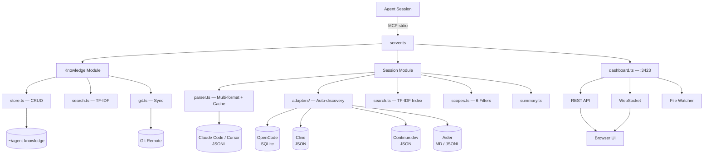
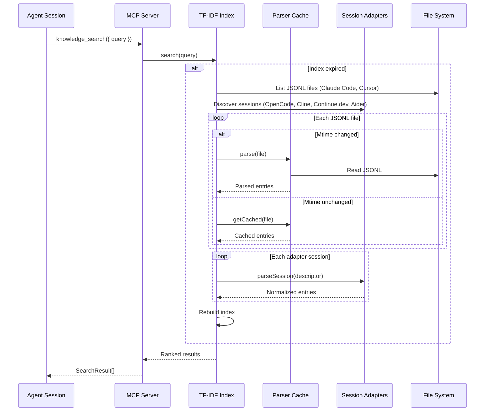

# Architecture

## Overview



## File Structure

```
src/
  index.ts              Entry point — MCP stdio + dashboard auto-start
  server.ts             16 tool definitions, request routing, error handling
  dashboard.ts          HTTP + WebSocket server, REST API, file watcher
  types.ts              KnowledgeConfig interface, getConfig()
  knowledge/
    store.ts            CRUD for markdown entries with YAML frontmatter
    search.ts           TF-IDF search over knowledge entries
    git.ts              git pull/push/sync with execSync + timeouts
    graph.ts            Knowledge graph — edges table, link/unlink/BFS traversal
    scoring.ts          Confidence/decay scoring — entry_scores table, auto-promotion
  sessions/
    parser.ts           Multi-format parsing with mtime cache + adapter dispatch
    search.ts           TF-IDF ranked search with 60s global index cache
    scopes.ts           6 search scopes, post-filters cached index results
    summary.ts          Topic extraction, tool/file detection
    adapters/
      index.ts          SessionAdapter interface, adapter registry, initAdapters()
      opencode.ts       OpenCode adapter — reads SQLite database (better-sqlite3)
      cline.ts          Cline adapter — reads VS Code globalStorage JSON tasks
      continue.ts       Continue.dev adapter — reads JSON session files
      aider.ts          Aider adapter — parses markdown chat + JSONL LLM history
  search/
    tfidf.ts            TF-IDF scoring engine (tokenizer, stopwords, index)
    fuzzy.ts            Levenshtein distance, sliding window matching
    types.ts            SearchResult, SearchOptions interfaces
  ui/
    index.html          Dashboard SPA
    styles.css           MD3 design tokens (light + dark)
    app.js              Client-side JS (WebSocket, tabs, rendering)
```

## Knowledge Module

### store.ts

CRUD for markdown files with YAML frontmatter:

- **parseFrontmatter()** — splits on `---` delimiters, extracts title/tags/updated
- **listEntries()** — recursively finds `.md` files, skips dot-directories, filters by category/tag
- **readEntry()** — reads file with path traversal protection (`path.resolve` must start with base dir)
- **writeEntry()** — validates category against allowed list, ensures directory exists, auto-adds `.md`
- **deleteEntry()** — removes file with path traversal protection

### git.ts

Wraps `execSync` for git operations with timeouts:

- `gitPull()` — `git pull --rebase --quiet` (15s timeout)
- `gitPush()` — `git add -A`, conditional commit (checks `git diff --cached --quiet`), push (5s/5s/15s)
- `gitSync()` — pull then push, returns both results

### search.ts

Builds a TF-IDF index from all knowledge entries, searches with ranking, falls back to regex for exact phrases.

## Knowledge Graph

### graph.ts

Manages typed, weighted edges between knowledge entries in a dedicated `edges` SQLite table.

**Schema**:

```sql
CREATE TABLE edges (
  source TEXT NOT NULL,
  target TEXT NOT NULL,
  rel_type TEXT NOT NULL,
  strength REAL DEFAULT 1.0,
  created TEXT NOT NULL,
  PRIMARY KEY (source, target, rel_type)
);
```

**8 relationship types**: `related_to`, `supersedes`, `depends_on`, `contradicts`, `specializes`, `part_of`, `alternative_to`, `builds_on`.

**Operations**:

- **link()** — upsert an edge (INSERT OR REPLACE), validates rel_type against allowed set
- **unlink()** — delete edges, optionally filtered by rel_type
- **links()** — list edges for a given entry or rel_type
- **traverse()** — BFS from a starting entry to configurable depth, returns nodes and edges visited

**Auto-linking**: On `knowledge_write`, the top-3 most similar existing entries are found via cosine similarity against the vector store. Entries with similarity > 0.7 get automatic `related_to` edges created.

## Confidence & Decay Scoring

### scoring.ts

Tracks access frequency and recency for search result ranking via an `entry_scores` SQLite table.

**Schema**:

```sql
CREATE TABLE entry_scores (
  path TEXT PRIMARY KEY,
  access_count INTEGER DEFAULT 0,
  last_accessed TEXT NOT NULL,
  maturity TEXT DEFAULT 'candidate'
);
```

**Scoring formula**:

```
finalScore = baseRelevance * 0.5^(daysSinceLastAccess / 90) * maturityMultiplier
```

**Maturity auto-promotion**:

| Stage         | Accesses | Multiplier |
| ------------- | -------- | ---------- |
| `candidate`   | < 5      | 0.5x       |
| `established` | 5-19     | 1.0x       |
| `proven`      | 20+      | 1.5x       |

Access count increments on `knowledge_read`. Maturity transitions happen automatically when thresholds are crossed. Search results from `knowledge_search` apply the decay formula to blend relevance with freshness and confidence.

## Session Module

### Multi-Source Architecture

Sessions are read from multiple AI coding tools through two mechanisms:

1. **Direct parsing** -- Claude Code and Cursor sessions use JSONL files read directly by `parser.ts`. Claude Code sessions come from the primary data directory (`$KNOWLEDGE_DATA_DIR/projects/`). Cursor sessions are auto-discovered from `~/.cursor/projects/*/agent-transcripts/`.

2. **Adapter dispatch** -- Other tools (OpenCode, Cline, Continue.dev, Aider) use the pluggable adapter system in `adapters/`. When `parseSessionFile()` receives a virtual descriptor (e.g. `opencode://session:abc`), it dispatches to the matching adapter.

```
parseSessionFile(path)
  → for each registered adapter:
      if path starts with `<adapter.prefix>://` → adapter.parseSession(path)
  → else: standard JSONL parsing with mtime cache
```

### Session Adapters

The adapter system (`src/sessions/adapters/`) provides a uniform interface for reading sessions from different tools:

```typescript
interface SessionAdapter {
  prefix: string;                    // Virtual descriptor prefix (e.g. "opencode")
  name: string;                      // Human-readable name
  isAvailable(): boolean;            // Is the tool installed?
  discoverProjects(): Array<{...}>;  // Find projects/groups
  listSessions(desc: string): Array<{...}>;  // List sessions in a project
  parseSession(desc: string): SessionEntry[];  // Parse into normalized entries
}
```

Adapters are registered at startup via `initAdapters()`, which dynamically imports each adapter module. `getAvailableAdapters()` returns only adapters whose `isAvailable()` returns true (the tool is installed).

| Adapter      | Storage                                         | Detection                                                                |
| ------------ | ----------------------------------------------- | ------------------------------------------------------------------------ |
| OpenCode     | SQLite (`opencode.db`)                          | Checks `$OPENCODE_DATA_DIR` or `~/.local/share/opencode/`                |
| Cline        | JSON files in VS Code globalStorage             | Platform-aware path to `saoudrizwan.claude-dev/tasks/`                   |
| Continue.dev | JSON files in `~/.continue/sessions/`           | Checks directory existence                                               |
| Aider        | `.aider.chat.history.md` + `.aider.llm.history` | Scans `~/projects`, `~/code`, `~/dev`, `~/src`, `~/repos`, `~/workspace` |

### parser.ts — Mtime Cache

For JSONL-based sessions (Claude Code, Cursor), the parser checks `fs.statSync` for mtime before parsing. If unchanged since last parse, returns cached result. This avoids re-parsing large transcript files on every search.

```
parseSessionFile(path)
  → if virtual descriptor → dispatch to adapter
  → statSync(path).mtimeMs
  → if mtime matches cache → return cached entries
  → else parse JSONL lines → cache with mtime → return
```

### search.ts — Global TF-IDF Index

Maintains a single TF-IDF index across all sessions with a 60-second TTL:

```
getOrBuildIndex(projects)
  → if cache exists AND age < 60s → return cached index
  → else scan all sessions → parse (using mtime cache) → index all messages → cache → return
```

Role filtering happens post-search: the index includes all roles, and results are filtered after scoring.

### scopes.ts

Uses the cached search index from `search.ts` (via `searchSessions`), then post-filters by scope patterns:

| Scope       | Filter                                                          |
| ----------- | --------------------------------------------------------------- |
| `errors`    | Regex: Error, Exception, failed, crash, ENOENT, TypeError, etc. |
| `plans`     | Regex: plan, step, phase, strategy, TODO, architecture, etc.    |
| `configs`   | Regex: config, .env, .json, tsconfig, docker, etc.              |
| `tools`     | Role filter: tool_use, tool_result messages only                |
| `files`     | Regex: src/, .ts, .js, created, modified, deleted, etc.         |
| `decisions` | Regex: decided, chose, because, tradeoff, opted for, etc.       |

### summary.ts

Extracts session summaries:

- **Topics**: user messages filtered to exclude JSON/tool_result/base64/system-reminders
- **Tools used**: tool names from tool_use entries
- **Files modified**: file paths detected via regex in tool_result content

## Search Engine

### tfidf.ts

Self-contained TF-IDF implementation:

**Tokenization**: lowercase → split on `[^a-z0-9]+` → remove ~100 English stopwords

**Scoring**:

```
TF(t, d)  = count(t in d) / total_terms(d)
IDF(t)    = log(1 + N / docs_containing(t))
Score(q, d) = sum(TF(t, d) * IDF(t)) for each term t in query q
```

The `1 +` in IDF ensures single-document results still get a positive score.

### fuzzy.ts

Levenshtein edit distance with two-row DP (O(n\*m) time, O(m) space). Fuzzy matching uses a sliding window of varying size to find approximate substring matches.

## Dashboard

### dashboard.ts

Single HTTP server handles both REST API and static files:

- **Static serving**: resolves UI directory (checks `src/ui/` then `dist/ui/`), serves with MIME detection and CSP headers
- **REST API**: routes for knowledge CRUD/search, session list/search/recall/get/summary, health
- **WebSocket**: `ws` library with `noServer` mode, heartbeat every 30s, initial state snapshot on connect
- **File watcher**: `fs.watch` on UI directory, debounced 200ms, broadcasts `{type: "reload"}` to all WS clients

### UI Architecture

Vanilla JS SPA (no framework, no build step):

- WebSocket connects on load, handles `state` and `reload` messages
- 4 tabs with lazy data loading
- `marked` + `DOMPurify` + `highlight.js` for markdown rendering
- Theme persisted in `localStorage('agent-knowledge-theme')`

## Caching Strategy

```
Search Request
    │
    ▼
┌─────────────────────┐
│ TF-IDF index < 60s? │──Yes──► Search cached index (~40ms)
└─────────────────────┘
    │ No
    ▼
┌─────────────────────┐
│ Scan session files  │
│ Check mtime cache   │──► Parse only changed files
└─────────────────────┘
    │
    ▼
┌─────────────────────┐
│ Rebuild index       │──► Cache with 60s TTL (~5s cold)
└─────────────────────┘
    │
    ▼
  Search new index
```

## Data Flow

### Session Search



### Knowledge Write


